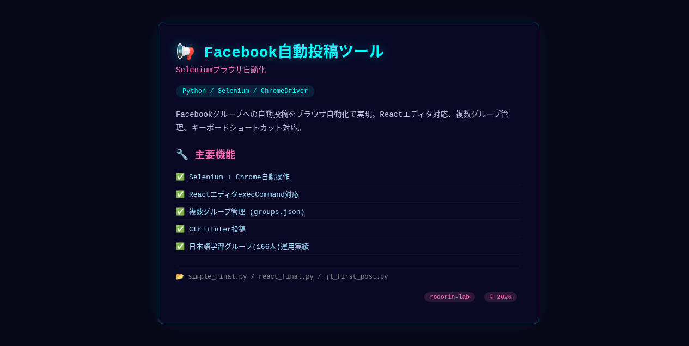

# 📢 Facebookグループ自動投稿ツール

 

Facebookグループへの **自動投稿をブラウザ自動化で実現** するツール群だよ！

## 🎯 できること

## 📸 スクリーンショット



- 📝 **グループ投稿自動化** — Selenium + Chromeで実際のブラウザ操作
- ⚛️ **Reactエディタ対応** — Facebookのリッチテキストエディタに `execCommand` で入力
- 🌐 **多グループ対応** — `groups.json` で複数グループ管理
- ⌨️ **キーボードショートカット** — Ctrl+Enter投稿対応
- 🎨 **絵文字対応** — ChromeDriver BMP制限に注意

## 📂 主要ファイル

| ファイル | 内容 |
|----------|------|
| `simple_final.py` | 最終版・安定動作 |
| `react_final.py` | React editor直接操作版 |
| `jl_first_post.py` | 日本語学習グループ初回投稿 |
| `invader_game_post.py` | invader-game宣伝投稿 |
| `mbasic.py` | Facebook Basicモード経由 |
| `keyboard_approach.py` | キーボード操作アプローチ |
| `js_inject.py` | JavaScriptインジェクション方式 |

## 🚀 使い方

```bash
pip install selenium
python3 simple_final.py
```

> ⚠️ Chrome + ChromeDriver が必要です。Gentoo/Hyprland/Wayland環境では調整が必要。

## 🎯 実績

- ✅ 日本語学習グループ（166人）での投稿成功
- ✅ Evolving AI Labページ運営
- ✅ coding4beginnersグループ投稿

## 📝 作者

- **ロドリン** & **シンクロ（グラム）** 💎🛸
- rodorin-lab © 2026
